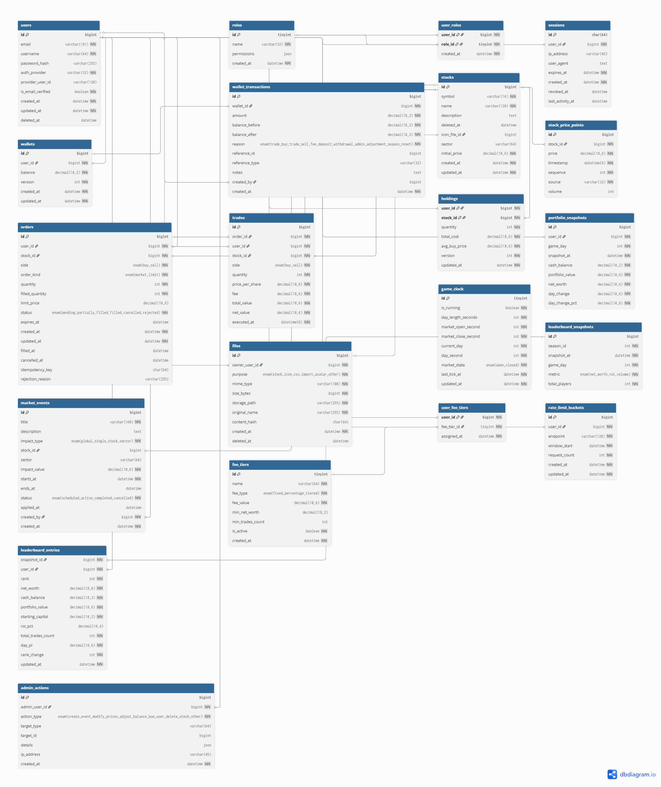
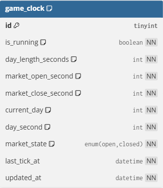
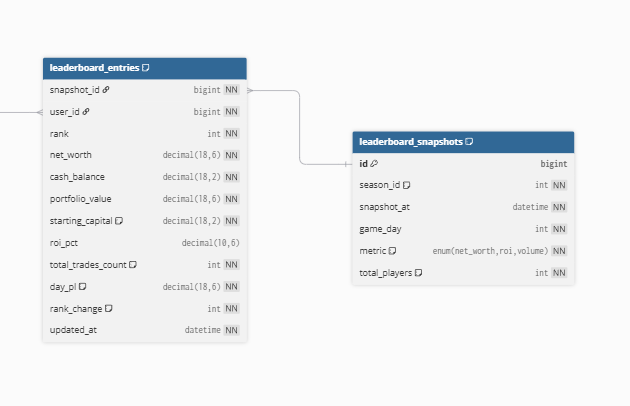

Dnes som dokončil návrh databázovej štruktúry, ktorá bude použitá priamo
v projekte Virtual Stock Market Simulator. Databáza je navrhnutá ako
production-ready základ pre hernú simuláciu akciového trhu.

## Návrh databázy – prehľad

Databázový model pokrýva celé fungovanie aplikácie:
používateľov, obchodovanie, ceny akcií, herný čas a dynamický leaderboard.

---

## Vybrané tabuľky a stĺpce

**users**

- id (BIGINT) – primárny kľúč
- email (VARCHAR(191)) – unikátny prihlasovací údaj
- username (VARCHAR(64))
- deleted_at (DATETIME, NULL) – soft delete používateľa

**wallets**

- user_id (BIGINT, UNIQUE) – väzba 1:1 na používateľa
- balance (DECIMAL(18,2)) – aktuálny zostatok
- version (INT) – optimistic locking

**stocks**

- symbol (VARCHAR(16)) – identifikátor akcie
- sector (VARCHAR(64)) – kategorizácia
- initial_price (DECIMAL(18,6))

**orders**

- side (ENUM: buy/sell)
- order_kind (ENUM: market/limit)
- quantity (INT)
- status (ENUM: pending, filled, cancelled…)

**leaderboard_entries**

- rank (INT)
- net_worth (DECIMAL(18,6))
- portfolio_value (DECIMAL(18,6))
- rank_change (INT)

---

## Herný čas a dynamika trhu

Diagram znázorňuje tabuľku game_clock, ktorá riadi herný čas.
Jeden herný deň trvá 20 minút a obsahuje fázu otvoreného a zatvoreného trhu.
Tento prístup umožňuje jednoduchú simuláciu burzových hodín.

---

## Dynamický leaderboard

Leaderboard je riešený pomocou cached snapshotov:
server pravidelne prepočítava hodnotu portfólií a ukladá výsledky.
Frontend iba číta hotové dáta, čo umožňuje plynulé animácie
a veľmi rýchlu odozvu.

Schéma znázorňuje prechod medzi snapshotmi a ich využitie vo fronte.

---

## Backend a databázová integrácia

Backend je postavený pomocou **Hono.js**.
Na prácu s databázou sa používa knižnica **better-sqlite3**.

Použité balíky:

- better-sqlite3 (runtime)
- @types/better-sqlite3 (dev dependency)

Databázový kód je spúšťaný v watch režime:
zmena zdrojového súboru automaticky reštartuje databázový proces,
čo zjednodušuje vývoj a testovanie.

---

## Záver

Navrhnutá databáza tvorí pevný základ pre hernú simuláciu akciového trhu.
Je navrhnutá s dôrazom na realistické správanie, rozšíriteľnosť
a jednoduché napojenie na backendovú logiku projektu.
