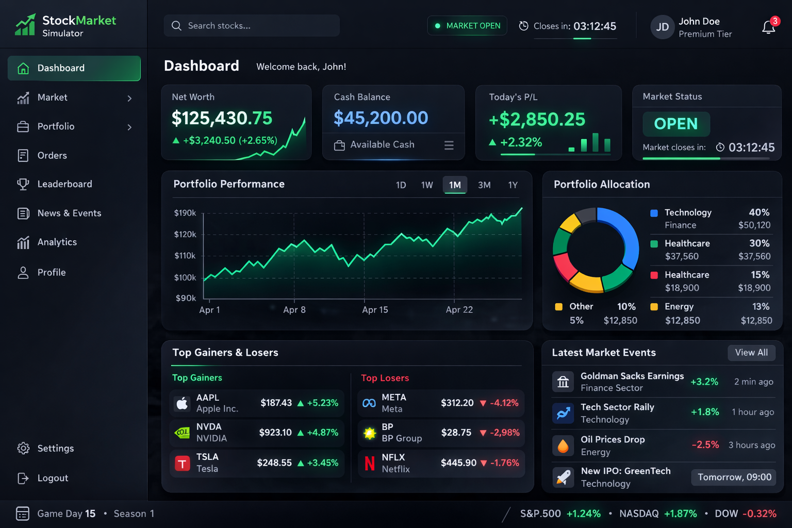
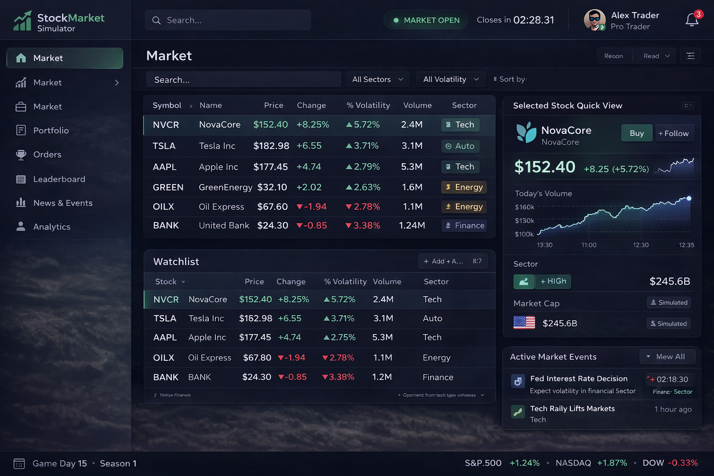
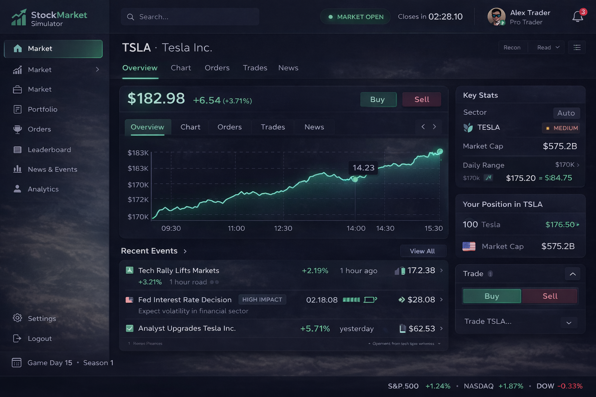
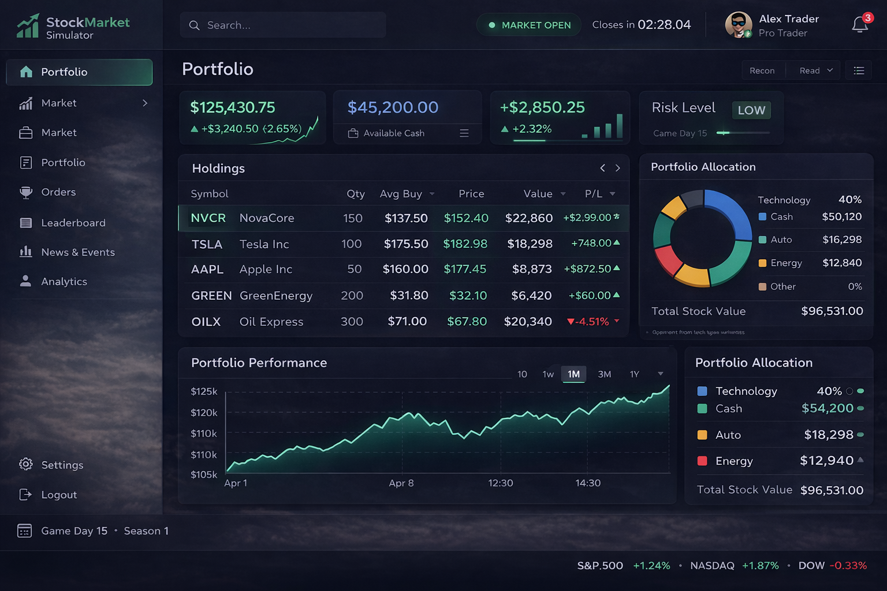
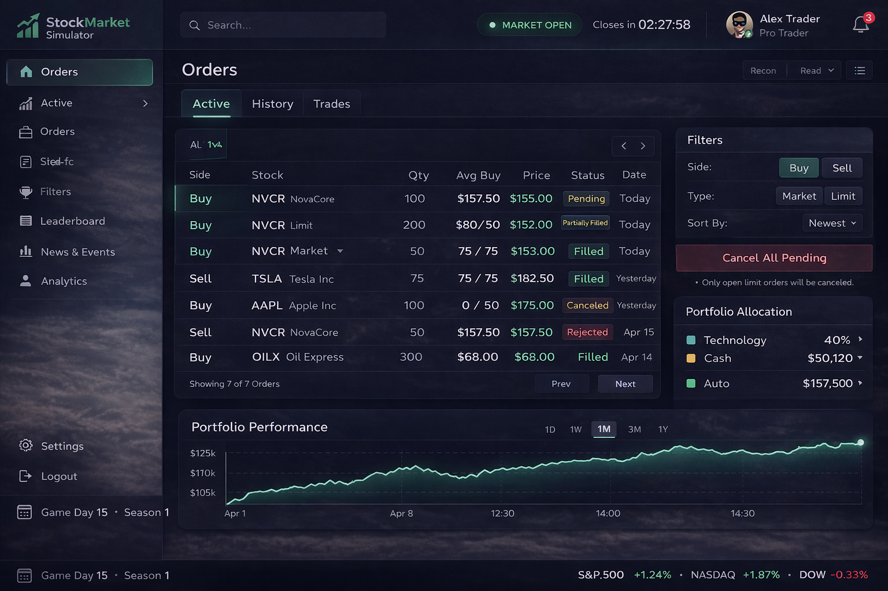
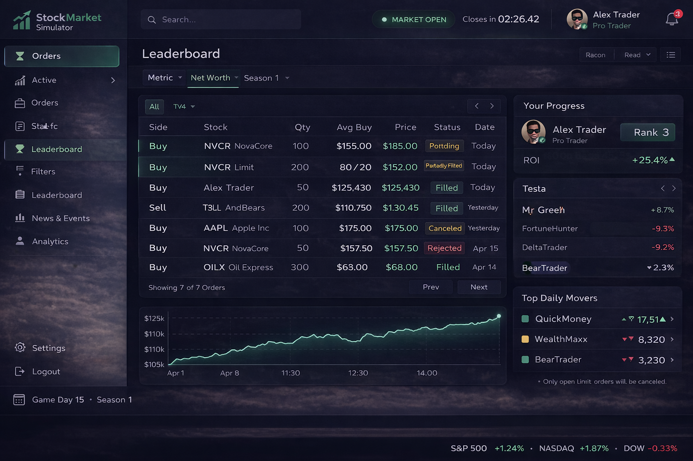
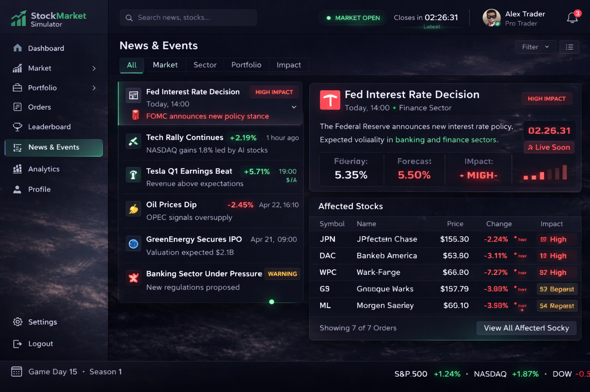
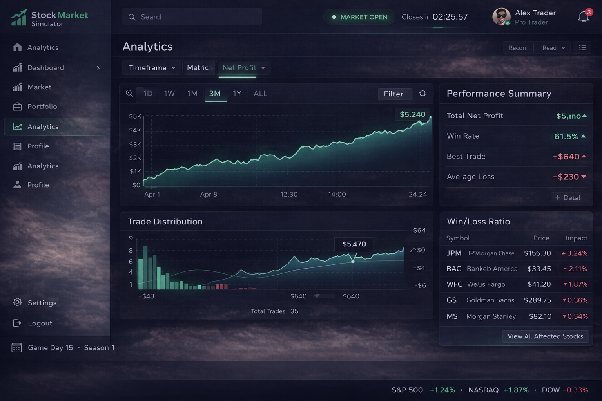
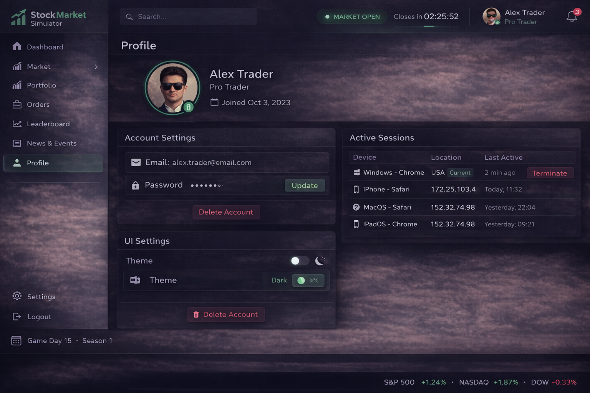
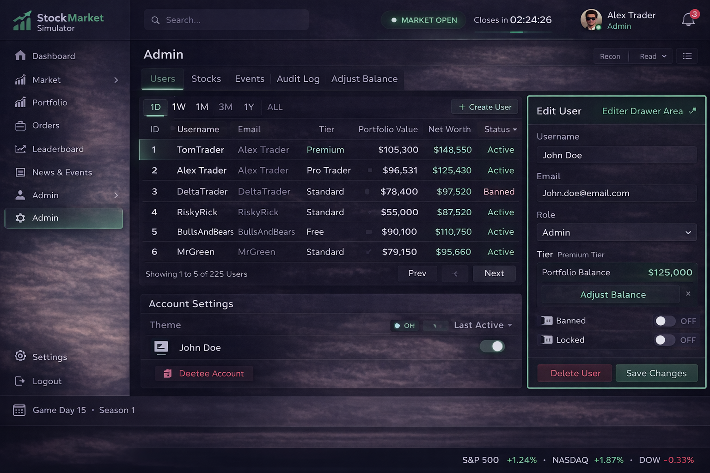

Tento týždeň som sa zameral na návrh wireframov a kompletný UI dizajn pre projekt  **Virtual Stock Market Simulator** .

Cieľom bolo vytvoriť prehľadné, profesionálne a konzistentné rozhranie inšpirované štýlom Football Manager – teda tmavý moderný minimalizmus, dôraz na dátové tabuľky, jasnú hierarchiu informácií a „control panel“ pocit.

Najskôr som navrhol základný layout aplikácie (AppShell) so stabilným sidebarom, horným status barom a hlavným obsahovým grid systémom (8/4, 7/5 rozdelenia). Tento layout sa následne používa konzistentne na všetkých podstránkach.

Vytvoril som wireframy a vizuálne návrhy pre hlavné obrazovky:

Dashboard, Market, Stock Detail, Portfolio, Orders, Leaderboard, News & Events, Analytics, Profile a Admin.

Dizajn rešpektuje jednotnú farebnú schému:

tmavé modro-čierne pozadie, jemné sklenené panely (glass effect), zelené akcenty pre pozitívne hodnoty a červené pre negatívne zmeny. Dôležité je aj farebné rozlíšenie stavov (open/closed market, filled/cancelled order, high impact event).

Osobitný dôraz som kládol na:

* dynamické leaderboardy s „airport scoreboard“ animáciou čísel,
* realtime aktualizácie grafov,
* jasnú vizuálnu hierarchiu dát,
* konzistentné kartové komponenty a tabuľkové rozhrania,
* prepojenosť medzi stránkami (napr. klik na holding otvorí detail akcie).

Admin rozhranie je navrhnuté ako profesionálny control panel s tabuľkou a editor drawerom, aby bolo možné efektívne spravovať používateľov, udalosti a audit log.

Celkový UI dizajn pôsobí ako realistická burzová platforma, no zároveň herne a dynamicky.

Návrh je pripravený na implementáciu vo Vue (komponentová architektúra) a podporuje realtime komunikáciu aj rozšírenie o ďalšie analytické funkcie.

Týmto krokom máme pevný vizuálny základ, na ktorom môžeme začať systematicky budovať frontend implementáciu.

Obrázky:

(ChatGPT)

Exacalidraw link:
https://excalidraw.com/#json=wKBe6TrsySkqn0hit5KS7,lsw6VQOqosP7scTYvXYU6Q
